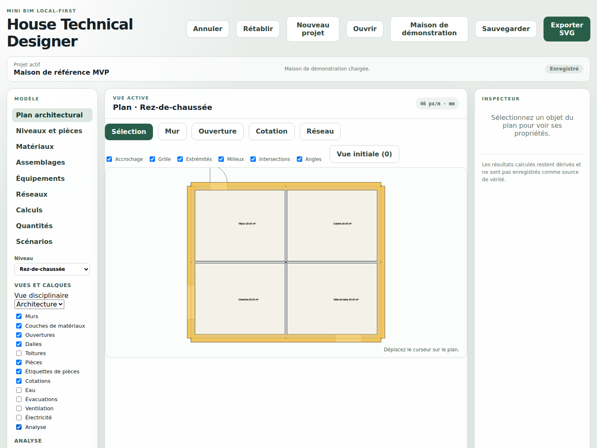

# House Technical Designer

[](https://github.com/glloq/Mini-BIM-House/actions/workflows/ci.yml)
[](LICENSE)


> **Version 0.2.0-beta.1 — bêta.** L'application couvre le parcours complet et
> ses formats sont stabilisés ; l'interface peut encore bouger et plusieurs
> sujets restent hors périmètre. Voir
> [Ce que l'application ne fait pas](#ce-que-lapplication-ne-fait-pas), le
> [journal des versions](CHANGELOG.md) et
> [l'état de préparation](docs/BETA_READINESS.md).

**House Technical Designer** est une application web open source de **conception et d'étude technique d'une habitation**, pensée comme un **mini-BIM résidentiel modulaire**.

L'objectif est de réunir dans une seule interface :

- la conception architecturale 2D ;
- les matériaux et compositions de parois ;
- les calculs thermiques et énergétiques ;
- les réseaux d'eau, ventilation et électricité ;
- l'éclairage et l'acoustique ;
- le photovoltaïque et le stockage ;
- les métrés, coûts et impacts environnementaux ;
- les contrôles techniques et réglementaires via des règles versionnées.

> **Dessiner une seule fois le bâtiment, puis utiliser ce même modèle pour toutes les études techniques.**



---

## Démarrage rapide

L'application est publiée sur GitHub Pages après chaque CI verte sur `main` :
<https://glloq.github.io/Mini-BIM-House/>. Tout se passe dans le navigateur ;
aucun projet n'est envoyé sur un serveur.

En local, avec Node.js 22 ou plus récent :

```bash
git clone https://github.com/glloq/Mini-BIM-House.git
cd Mini-BIM-House
npm ci
npm run dev
```

Puis, dans l'application :

1. **Maison de démonstration** ouvre la maison de référence, quatre pièces
   déjà dessinées et calculables ;
2. l'onglet **Calculs** exécute les dix-sept modules et affiche, pour chacun, sa
   méthode, ses hypothèses et ses entrées manquantes ;
3. la **Superposition** projette un résultat sur le plan ;
4. **Sauvegarder** exporte le projet et ses jeux climatiques dans un seul
   fichier `.houseproj`, **Exporter le JSON** le projet seul, **Exporter SVG**
   le plan.

Un **Nouveau projet** part vide mais utilisable : la bibliothèque générique de
matériaux et d'assemblages est déjà là, l'outil **Mur** dessine tout de suite.

Le parcours complet est décrit dans
[`docs/USER_GUIDE_MVP.md`](docs/USER_GUIDE_MVP.md).

---

## Objectif

Les logiciels de calcul du bâtiment sont souvent spécialisés : thermique, photovoltaïque, plomberie, ventilation, électricité, etc.

House Technical Designer cherche au contraire à créer un environnement commun où les différents systèmes peuvent interagir.

```text
Isolation
   ↓
Déperditions thermiques
   ↓
Besoin de chauffage
   ↓
Consommation électrique
   ↓
Dimensionnement photovoltaïque
   ↓
Dimensionnement batterie
```

Une modification du bâtiment doit pouvoir recalculer automatiquement les modules concernés.

---

## Principes du projet

### Un modèle unique du bâtiment

Les murs, ouvertures, pièces, toitures, matériaux et équipements ne sont jamais redessinés indépendamment pour chaque module.

```text
BUILDING MODEL
      │
      ├── Architecture
      ├── Thermal
      ├── Water
      ├── Ventilation
      ├── Electrical
      ├── Lighting
      ├── Acoustics
      ├── Photovoltaic
      └── Cost / Environment
```

### Une interface graphique technique

L'application doit privilégier la représentation visuelle :

- plans architecturaux ;
- coupes ;
- hachures de matériaux ;
- réseaux techniques ;
- symboles ;
- cotations ;
- cartes de pertes thermiques ;
- débits ;
- pressions ;
- tensions ;
- niveaux d'éclairement ;
- résultats acoustiques.

Les conventions graphiques doivent rester aussi proches que possible des standards du dessin technique et architectural.

### Des calculs traçables

Chaque résultat doit pouvoir indiquer :

- les données utilisées ;
- la méthode ;
- les hypothèses ;
- les unités ;
- les avertissements ;
- les références techniques ;
- la version du module.

Une donnée inconnue doit rester **inconnue** : le logiciel ne doit pas inventer silencieusement une valeur.

---

# Architecture générale

```text
┌───────────────────────────────────────────────┐
│                 INTERFACE WEB                 │
├───────────────────────────────────────────────┤
│ Plans │ Inspecteurs │ Résultats │ Dashboards │
├───────────────────────────────────────────────┤
│              DRAWING ENGINE                   │
├───────────────────────────────────────────────┤
│ Editor │ Snap │ Commands │ Undo / Redo        │
├───────────────────────────────────────────────┤
│              BUILDING MODEL                   │
├───────────────────────────────────────────────┤
│ Materials │ Assemblies │ Equipment            │
├───────────────────────────────────────────────┤
│ Networks │ Rules │ Standards │ Climate        │
├───────────────────────────────────────────────┤
│           CALCULATION ENGINE                  │
├───────────────────────────────────────────────┤
│ Thermal │ Water │ Air │ Electrical │ Energy   │
└───────────────────────────────────────────────┘
```

Le moteur métier reste indépendant de l'interface React.

---

# Modules prévus

## Architecture

- niveaux ;
- murs ;
- cloisons ;
- portes ;
- fenêtres ;
- pièces ;
- dalles ;
- toitures ;
- surfaces ;
- volumes ;
- cotations ;
- coupes et façades.

## Matériaux

- bibliothèque générale ;
- matériaux génériques ;
- produits fabricants ;
- matériaux personnalisés ;
- propriétés thermiques ;
- hygrométriques ;
- acoustiques ;
- physiques ;
- environnementales ;
- provenance des données.

Les utilisateurs pourront ajouter leurs propres matériaux sans modifier le code.

## Parois multicouches

```text
Extérieur
│
├── Enduit
├── Maçonnerie
├── Isolation
├── Frein-vapeur
├── Vide technique
└── Plaque de plâtre
│
Intérieur
```

Une composition sert simultanément au dessin, aux hachures, au thermique, à l'hygrothermie, à l'acoustique, aux métrés, au coût et à l'analyse environnementale.

## Thermique

- résistance thermique ;
- coefficient U ;
- déperditions ;
- ponts thermiques ;
- températures de surface ;
- analyse par pièce ;
- comparaison de variantes.

## Hygrothermie

- diffusion de vapeur ;
- point de rosée ;
- condensation interstitielle ;
- risque de condensation superficielle.

## Chauffage / ECS

- charge par pièce ;
- puissance nécessaire ;
- émetteurs ;
- PAC ;
- chaudière ;
- chauffage électrique ;
- besoins ECS ;
- ballon ;
- temps de chauffe ;
- énergie consommée.

## Photovoltaïque / batterie

- surfaces disponibles ;
- orientation ;
- inclinaison ;
- implantation automatique ;
- obstacles ;
- puissance installable ;
- productible ;
- strings ;
- onduleur ;
- capacité batterie ;
- SOC ;
- autoconsommation ;
- autosuffisance ;
- import/export réseau.

Une intégration optionnelle avec **PVGIS** est prévue.

## Eau / eau de pluie

- eau froide et chaude ;
- réseaux non potables ;
- diamètres ;
- débits ;
- pertes de charge ;
- pression disponible ;
- récupération de pluie ;
- filtration ;
- cuve ;
- appoint ;
- trop-plein.

## Évacuation

- eaux usées ;
- eaux-vannes ;
- pentes ;
- diamètres ;
- colonnes ;
- ventilations ;
- profils altimétriques.

## Ventilation / qualité de l'air

- soufflage ;
- extraction ;
- gaines ;
- débits ;
- vitesses ;
- pertes de charge ;
- récupération de chaleur ;
- équilibrage ;
- CO₂ ;
- humidité.

## Électricité

- tableaux ;
- circuits ;
- prises ;
- luminaires ;
- équipements ;
- puissance ;
- courant ;
- sections ;
- chute de tension ;
- protections.

## Éclairage

- implantation ;
- flux lumineux ;
- éclairement ;
- lux ;
- puissance ;
- carte d'éclairement.

## Acoustique

- absorption ;
- temps de réverbération ;
- comparaison de traitements ;
- isolation acoustique future.

## Métrés / coûts / environnement

Le modèle pourra générer automatiquement :

- surfaces ;
- longueurs ;
- volumes ;
- masses ;
- équipements ;
- réseaux ;
- quantités d'achat ;
- coûts par lot ;
- impacts environnementaux ;
- FDES / PEP / données INIES.

---

# Réseaux techniques

Les réseaux sont représentés comme des graphes.

```text
SOURCE
  │
  ├── segment
  │
JUNCTION
  ├── segment
  │
TERMINAL
```

Cette infrastructure commune est destinée à la plomberie, au chauffage, à l'évacuation, à la ventilation, à l'électricité et à la récupération d'eau.

Les propriétés physiques restent spécifiques à chaque discipline.

---

# Conventions graphiques

Le moteur de dessin est basé principalement sur **SVG**.

Le projet prévoit :

- traits techniques ;
- épaisseurs de ligne ;
- hachures ;
- symboles ;
- cotations ;
- échelles ;
- calques ;
- cartouches ;
- légendes ;
- plans thématiques.

Références structurantes prévues :

- ISO 128 ;
- ISO 129 ;
- ISO 5455 ;
- ISO 5457 ;
- ISO 7200 ;
- ISO 13567.

Les conventions nationales ou réglementaires seront intégrées via des profils graphiques et des Rule Packs dédiés.

---

# Réglementation et Rule Packs

La réglementation ne doit pas être codée directement dans les moteurs physiques.

```text
Physical calculation
        │
        ▼
Technical result
        │
        ▼
Versioned Rule Pack
        │
        ▼
PASS / FAIL / WARNING / UNKNOWN
```

Un Rule Pack contient :

- juridiction ;
- domaine ;
- période de validité ;
- références ;
- paramètres ;
- règles.

Exemples futurs :

```text
FR-ELECTRICAL
FR-VENTILATION
FR-RAINWATER
FR-THERMAL
```

---

# Niveaux de précision

Chaque calcul annonce son niveau :

```text
ESTIMATE
ENGINEERING
STANDARD
REGULATORY
```

Le niveau `REGULATORY` ne doit être utilisé qu'après validation complète de la méthode correspondante.

---

# Technologies utilisées

```text
TypeScript strict     modèle, moteurs, application
React 19 / Vite 7     interface
SVG                   rendu du plan et export technique
JSON / JSON Schema    format projet et contrats validés
Vitest                tests unitaires, d'intégration et benchmarks
Playwright            tests navigateur sur la construction de production
ESLint / Prettier     qualité et format
GitHub Actions        CI et déploiement Pages
```

Les Web Workers sont prévus mais pas encore utilisés : la baseline de
performance montre que la charge la plus lourde d'une interaction tient
largement dans une image.

L'application fonctionne comme une application web statique et reste compatible
avec **GitHub Pages** : la construction a été vérifiée servie depuis un
sous-chemin de projet.

---

# Structure du dépôt

```text
/
├── apps/
│   └── web/                     application React/Vite
│
├── packages/
│   ├── units/                   conversions marquées SI ↔ édition
│   ├── geometry/                primitives et opérations en millimètres
│   ├── core-domain/             modèle canonique du projet
│   ├── materials/               catalogue et provenance des matériaux
│   ├── assemblies/              parois multicouches
│   ├── equipment-catalog/       définitions et instances d'équipements
│   ├── editor-core/             commandes, caméra, accrochage, outils
│   ├── drawing-engine/          scène sémantique et rendu SVG
│   ├── view-query/              calques, vues de plan, sélection, analyse
│   ├── quantities/              métrés dérivés de la géométrie
│   ├── calculation-core/        orchestrateur, dépendances, traçabilité
│   ├── calculation-adapters/    branchement projet → modules de calcul
│   ├── climate/                 jeux de données climatiques validés
│   ├── rule-engine/             Rule Packs versionnés
│   └── project-io/              chargement, migrations, sauvegarde locale
│
├── modules/                     dix-sept moteurs de calcul
│   ├── thermal/                 hygrothermal/  heating/     dhw/
│   ├── photovoltaic/            battery/       energy-balance/
│   ├── water/                   rainwater/     wastewater/
│   ├── ventilation/             iaq/           electrical/
│   ├── lighting/                acoustics/     cost/        environmental/
│
├── schemas/                     contrats JSON Schema
├── examples/                    fixtures validées, dont la maison de référence
├── e2e/                         tests navigateur Playwright
├── scripts/                     validation des schémas, audit des licences
└── docs/                        spécifications, normes, ADR, état, guide
```

---

# Format projet

Deux formats, le même projet :

```text
*.houseproj        projet et jeux climatiques, archive ZIP
*.houseproj.json   projet seul, JSON lisible
```

L'archive contient ce que son manifeste déclare, et rien d'implicite :

```text
manifest.json
project.json
climate/<jeu>.json
```

Un projet qui nomme un profil climatique sans le transporter ne recalcule rien
sur une autre machine : le conteneur les garde ensemble. Le JSON reste le format
d'inspection et d'outillage, et l'application ouvre indifféremment les deux.

Chaque fichier est versionné :

```json
{
  "schemaVersion": "1.0.0"
}
```

Les évolutions du format passent par des migrations explicites.

---

# Extensibilité

L'architecture prévoit dès le départ des évolutions importantes :

- simulation thermique dynamique ;
- confort d'été ;
- structure ;
- géotechnique ;
- lumière naturelle ;
- solaire thermique ;
- eaux grises ;
- assainissement ;
- triphasé ;
- recharge véhicule électrique ;
- domotique ;
- maintenance ;
- digital twin ;
- rénovation ;
- optimisation multicritère ;
- DXF ;
- IFC ;
- LiDAR ;
- plugins ;
- moteurs externes.

Une nouvelle discipline doit pouvoir être ajoutée principalement sous forme de :

```text
modules/new-domain/
catalogs/new-domain/
rules/new-domain/
symbols/new-domain/
views/new-domain/
```

sans casser le noyau.

---

# État du projet

**Version 0.2.0-beta.1, bêta.** L'application couvre le parcours complet :
dessiner, composer, calculer, superposer, métrer, comparer, exporter. Ce qu'un
fichier de projet promet d'une version à l'autre est écrit dans
[`CHANGELOG.md`](CHANGELOG.md).

## Ce que fait l'application

- **Plan** — murs en couches de matériaux, ouvertures percées avec leur
  débattement, pièces remplies et étiquetées, dalles, toitures et cotes
  associatives ; accrochage sur grille, extrémités, milieux et intersections ;
  contraintes de longueur et d'angle ; annulation et rétablissement de chaque
  commande.
- **Inspecteur** — la barre d'outils crée, l'inspecteur modifie : assemblage et
  rôle d'un mur, dimensions d'une ouverture, usage d'une pièce, pente d'une
  toiture, position d'un nœud de réseau.
- **Bibliothèques** — matériaux, assemblages multicouches et équipements
  éditables dans l'application, avec la provenance de chaque propriété et le
  refus de supprimer ce qui est encore référencé.
- **Bâtiment** — niveaux, détection des pièces, dalles et plans de toiture.
- **Réseaux techniques** — eau, évacuation, eaux pluviales, ventilation,
  chauffage et électricité : création, pose des nœuds sur le plan, liaison des
  ports, longueurs développées et diagnostics.
- **Calculs** — dix-sept modules exécutés depuis l'interface, chacun affichant sa
  méthode, sa précision, ses hypothèses, ses références et ses entrées
  manquantes.
- **Analyse** — les résultats se projettent sur le plan en bandes légendées.
- **Vérifications** — ce que le modèle, les réseaux, les calculs et le métré ne
  résolvent pas, rassemblé avec le chemin pour le corriger. Aucune conformité
  réglementaire n'y est constatée.
- **Projet** — nom, auteur, site, orientation, localisation, contexte
  réglementaire, jeux climatiques et réglages de calcul des dix-sept modules.
- **Quantités** — nomenclature par lot et par niveau, masses, coûts et carbone,
  export CSV, avec les matériaux non valorisés signalés comme tels.
- **Scénarios** — création, duplication et comparaison d'une variante au projet
  de base, sans dupliquer le projet, et promotion d'une variante en projet.
- **Fichiers** — export JSON canonique et SVG, import validé, sauvegarde locale
  automatique et restauration proposée — jamais appliquée en silence.

## Ce que l'application ne fait pas

- **Escaliers** : délibérément reportés.
- **Exports PDF, DXF et IFC** : hors périmètre de la 0.1 ; l'export technique
  se fait en SVG.
- **Simulation thermique dynamique, confort d'été, structure, géotechnique,
  éclairage naturel** : hors périmètre de la 0.1.
- **Modes QUICK / DESIGN / EXPERT, assistant de création, palette de
  commandes** : non implémentés.
- **Édition géométrique fine** : déplacer l'extrémité d'un mur, le scinder ou
  le raccorder à la souris n'est pas encore possible ; la géométrie se dessine
  et se supprime, elle ne se remanie pas.
- **Conformité réglementaire** : le moteur de règles et les Rule Packs
  existent ; l'espace Vérifications rassemble les constats du modèle et des
  calculs, mais aucun référentiel réglementaire n'est livré, et rien n'est
  affirmé conforme.
- **Données fabricant** : les catalogues livrés sont génériques et le disent.
  Aucune valeur générique n'est présentée comme une donnée fabricant.

## Ce sur quoi vous pouvez compter

- Aucune constante silencieuse : chaque entrée de calcul vient du projet, d'un
  scénario, d'un réglage de module ou d'une source identifiée, et le dit.
- Une valeur inconnue reste inconnue : elle n'est jamais remplacée par zéro ni
  par une valeur typique. Elle est nommée.
- Les résultats calculés sont dérivés ; ils ne sont pas enregistrés comme
  source de vérité.

L'état détaillé, chantier par chantier, est tenu dans
[`docs/IMPLEMENTATION_STATUS.md`](docs/IMPLEMENTATION_STATUS.md).

---

# Roadmap générale

```text
1. Core / Units
2. Geometry
3. Building Model
4. SVG Drawing Engine
5. Editor / Undo / Redo
6. Materials / Assemblies
7. Quantities
8. Calculation Core
9. Thermal
10. Rule Engine
11. Generic Networks
12. Water
13. Rainwater
14. Ventilation
15. Electrical
16. Lighting
17. Photovoltaic / Battery
18. Energy Balance
19. Remaining Modules
20. Technical Exports
```

Le plan détaillé est disponible dans :

[`IMPLEMENTATION_PLAN.md`](IMPLEMENTATION_PLAN.md)

---

# Documentation

La documentation technique est disponible dans :

[`docs/README.md`](docs/README.md)

Documents principaux :

- [`ARCHITECTURE.md`](ARCHITECTURE.md)
- [`IMPLEMENTATION_PLAN.md`](IMPLEMENTATION_PLAN.md)
- [`docs/IMPLEMENTATION_STATUS.md`](docs/IMPLEMENTATION_STATUS.md) — état réel, chantier par chantier
- [`docs/USER_GUIDE_MVP.md`](docs/USER_GUIDE_MVP.md) — parcours utilisateur
- [`docs/PERFORMANCE_BASELINE.md`](docs/PERFORMANCE_BASELINE.md) — chiffres mesurés
- [`docs/specifications/`](docs/specifications/)
- [`docs/standards/`](docs/standards/)
- [`docs/adr/`](docs/adr/)
- [`schemas/`](schemas/)
- [`examples/`](examples/)

Chaque sujet n'a qu'un seul document ; la carte se trouve en tête de
[`docs/README.md`](docs/README.md).

---

# Philosophie

House Technical Designer cherche à conserver trois caractéristiques :

### Simple à utiliser

L'utilisateur doit pouvoir utiliser uniquement les modules qui l'intéressent.

### Technique

Les résultats doivent rester détaillés, vérifiables et traçables.

### Modulaire

Le logiciel doit pouvoir évoluer sans devenir un monolithe impossible à maintenir.

L'objectif final est de disposer d'un outil permettant de :

```text
DESSINER
   ↓
DÉCRIRE
   ↓
CALCULER
   ↓
VISUALISER
   ↓
COMPARER
   ↓
CONTRÔLER
```

les principaux systèmes techniques d'une habitation depuis un même modèle cohérent.

---

# Licence

Mini-BIM-House est distribué sous licence **GNU Affero General Public License v3.0 only** (AGPL-3.0-only). Le texte complet est dans [`LICENSE`](LICENSE).

Concrètement :

- vous pouvez utiliser, étudier, modifier et redistribuer le logiciel ;
- toute version modifiée que vous distribuez doit rester sous AGPL-3.0 ;
- si vous mettez une version modifiée à disposition via un réseau, y compris comme application web hébergée, vous devez en proposer les sources aux utilisateurs de cette instance (section 13).

Les normes, catalogues fabricants et bases externes ont leurs propres conditions de licence : ils ne sont pas redistribués avec ce dépôt et doivent être obtenus auprès de leurs éditeurs. Les valeurs livrées dans les exemples et les catalogues intégrés sont des données génériques de démonstration, jamais des données fabricant.
